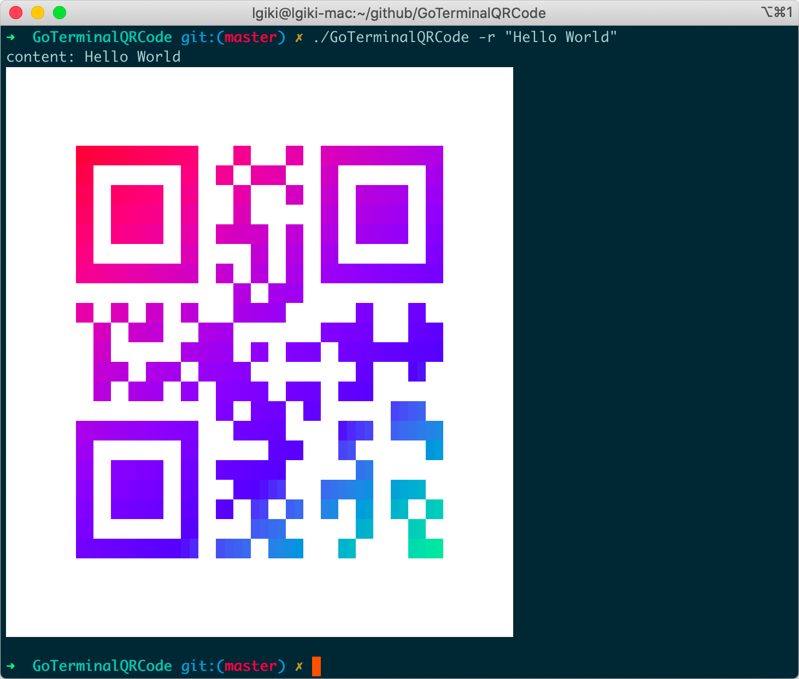

# Go Terminal QR Code

:rainbow: ​Generate QR code in your terminal.

# Screenshot


# Build

```bash
git clone https://github.com/LGiki/GoTerminalQRCode.git
cd GoTerminalQRCode
go mod download
go build
```

Then you can find the output binary file named `GoTerminalQRCode`.

# Usage

Basic usage:

```bash
./GoTerminalQRCode [OPTIONS]... <message>
```

For example, you can generate QR code in your terminal by:

```bash
./GoTerminalQRCode "Your Message Here"
```

This program also supports receiving input from pipeline:

```bash
echo -n "Your Message Here" | ./GoTerminalQRCode
```

## Command-line Flags

You can invoke it with `-h` or `--help` to display the help message.

### :rainbow: Rainbow Mode

As you can see in the screenshot, enabling rainbow mode will generate a rainbow QR code.

You can enable rainbow mode using `-r` flag.

### True Color Mode

If your terminal support 24-bit foreground and background color setting, you can enable true color mode using `-t` flag. 

When the value of `COLORTERM` environment variable is `truecolor`, the program will automatically enable true color mode.

### Rainbow Spread

Using `-s <spread_value>` flag to set rainbow spread value, default value is `3.0`.

### Rainbow Frequency

Using `-f <frequency_value>` flag to set rainbow frequency value, default value is `0.1`.

# References

- [https://en.wikipedia.org/wiki/ANSI_escape_code](https://en.wikipedia.org/wiki/ANSI_escape_code)
- [https://github.com/busyloop/lolcat/](https://github.com/busyloop/lolcat/)
- [https://github.com/janlelis/paint/](https://github.com/janlelis/paint/)
